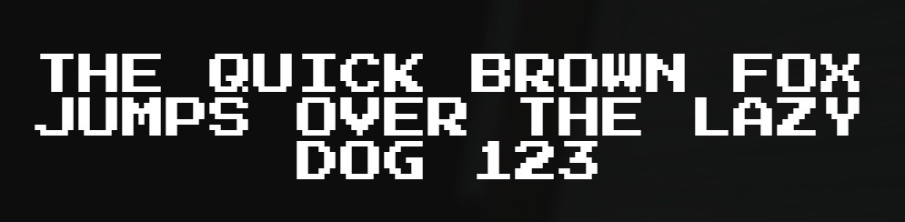
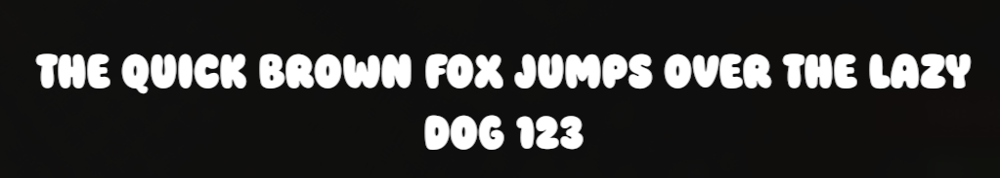
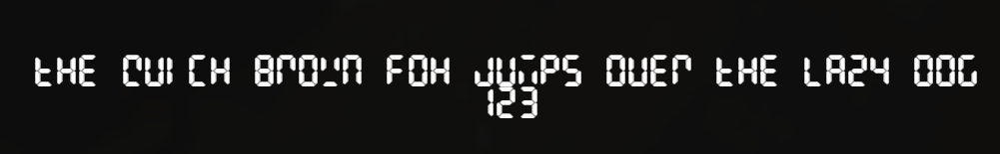
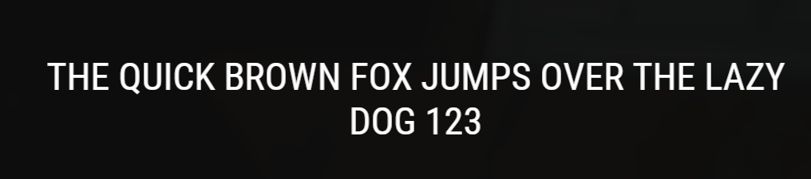
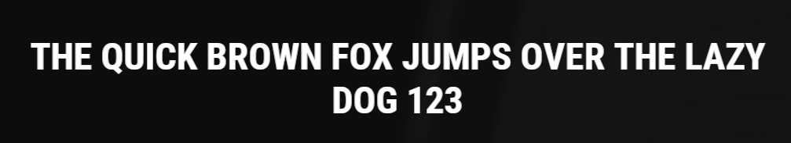
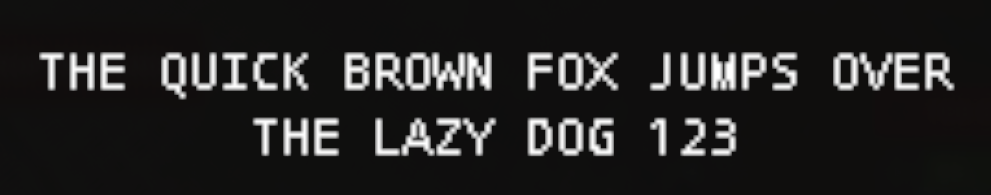
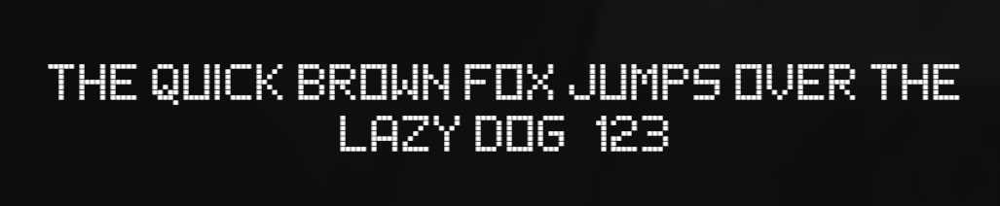
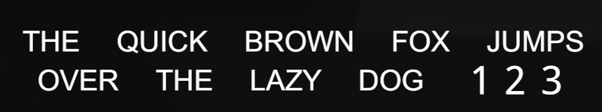
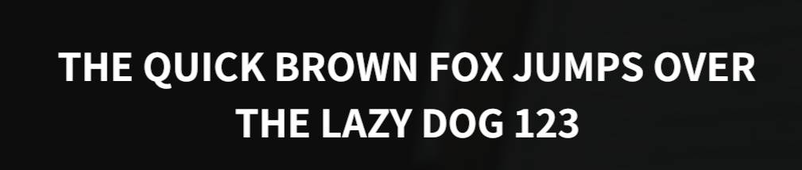

# 🎨 Rust UI Fonts & Previews

[](#)
[](#)
[](#)

В данном репозитории собраны оригинальные файлы шрифтов (`.ttf`) и изображения их отображения (`.png`), извлеченные из ресурсов (AssetBundles) игры **Rust**.

Этот ресурс предназначен для разработчиков плагинов (Oxide, Carbon), дизайнеров интерфейсов и администраторов серверов Rust для точной стилизации и использования встроенных игровых шрифтов в кастомных меню (Custom UI / CUI).

---

## 📋 Галерея Шрифтов и Оригинальные Пути (Asset Paths)

Для использования шрифта в CUI (через JSON или C# CuiHelper) необходимо указывать его **точный внутренний путь к ассету**. Ниже представлены шрифты, их пути и визуальное отображение:

### 1. 🎮 Press Start 2P
* **Путь к ассету**: `assets/content/ui/fonts/pressstart2p-regular.ttf`
* **Файл**: [PressStart2P-Regular.ttf](PressStart2P-Regular.ttf)
* **Превью**:
  

---

### 2. 🧸 Super Chiby
* **Путь к ассету**: `assets/content/ui/fonts/superchiby/super chiby.ttf`
* **Файл**: [Super_Chiby.ttf](Super_Chiby.ttf)
* **Превью**:
  

---

### 3. ✍️ Permanent Marker
* **Путь к ассету**: `assets/content/ui/fonts/permanentmarker.ttf`
* **Файл**: [PermanentMarker.ttf](PermanentMarker.ttf)
* **Превью**:
  

---

### 4. 📟 LCD (Digital)
* **Путь к ассету**: `assets/content/ui/fonts/lcd/lcd.ttf`
* **Файл**: [LCD.ttf](LCD.ttf)
* **Превью**:
  

---

### 5. 📰 Roboto Condensed Regular
* **Путь к ассету**: `assets/content/ui/fonts/robotocondensed-regular.ttf`
* **Файл**: [RobotoCondensed-Regular.ttf](RobotoCondensed-Regular.ttf)
* **Превью**:
  

---

### 6. 📛 Roboto Condensed Bold
* **Путь к ассету**: `assets/content/ui/fonts/robotocondensed-bold.ttf`
* **Файл**: [RobotoCondensed-Bold.ttf](RobotoCondensed-Bold.ttf)
* **Превью**:
  

---

### 7. ⌨️ Droid Sans Mono (Roboto Mono / Poxel)
* **Путь к ассету (Mono)**: `assets/content/ui/fonts/robotomono-regular.ttf` (или `robotomono-bold.ttf`)
* **Файлы**: [RobotoMono-Regular.ttf](RobotoMono-Regular.ttf) / [RobotoMono-Bold.ttf](RobotoMono-Bold.ttf)
* **Превью**:
  
  

---

### 8. 😊 Noto Emoji & CJK (East Asian Support)
* **Путь к ассету (Emoji)**: `assets/content/ui/fonts/_nonenglish/notoemoji-regular.ttf`
* **Файлы**: [NotoEmoji-Regular.ttf](NotoEmoji-Regular.ttf)
* **Превью**:
  
  

---

### 9. Другие локализованные шрифты (Без отдельного превью)
* **Roboto Regular** (Основной шрифт интерфейсов): `assets/content/ui/fonts/_roboto/roboto-regular.ttf` | [Roboto-Regular.ttf](Roboto-Regular.ttf)
* **Noto Sans Arabic Regular**: `assets/content/ui/fonts/_nonenglish/arabic/notosansarabic-regular.ttf` | [NotoSansArabic-Regular.ttf](NotoSansArabic-Regular.ttf)
* **Noto Sans Arabic Bold**: `assets/content/ui/fonts/_nonenglish/arabic/notosansarabic-bold.ttf` | [NotoSansArabic-Bold.ttf](NotoSansArabic-Bold.ttf)
* **Noto Sans Hebrew Bold**: `assets/content/ui/fonts/_nonenglish/hebrew/notosanshebrew-bold.ttf` | [NotoSansHebrew-Bold.ttf](NotoSansHebrew-Bold.ttf)

---

## 💻 Примеры использования в CUI

### Пример в JSON-конфиге Oxide CUI
При создании элемента интерфейса типа `CuiLabel`, укажите оригинальный путь в поле `"font"`:

```json
{
  "name": "MyCustomLabel",
  "parent": "MyParentPanel",
  "components": [
    {
      "type": "UnityEngine.UI.Text",
      "text": "ДОБРО ПОЖАЛОВАТЬ НА СЕРВЕР!",
      "fontSize": 20,
      "align": "MiddleCenter",
      "color": "1 1 1 1",
      "font": "assets/content/ui/fonts/permanentmarker.ttf"
    },
    {
      "type": "RectTransform",
      "anchorsMin": "0 0",
      "anchorsMax": "1 1"
    }
  ]
}
```

---

## 🛠️ Как использовать файлы из этого репозитория в дизайне (Figma / Photoshop)

Если вы разрабатываете макеты интерфейсов (UI Mockups) на компьютере:
1. Скачайте интересующий `.ttf` файл из этого репозитория.
2. Установите его в вашу операционную систему (дважды кликните по файлу -> «Установить»).
3. Теперь этот шрифт доступен во всех графических редакторах под своим оригинальным названием (например, *Press Start 2P*, *Permanent Marker*, *Super Chiby*).

---

**TEAM_RUST_PLUGINS — TRP Perfect Standard**
